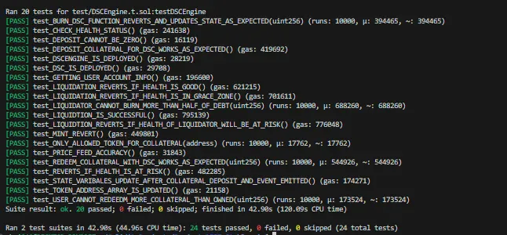
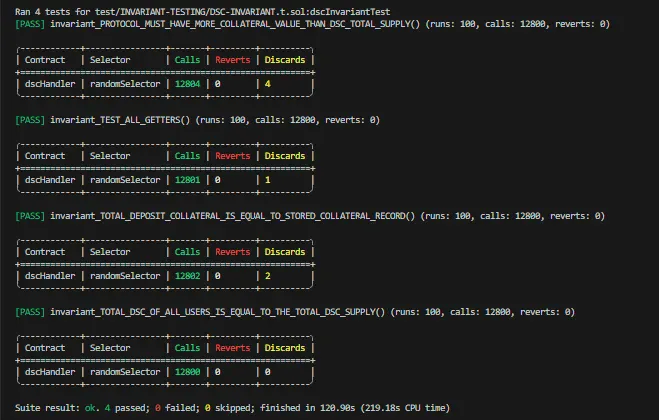

# Decentralized Stablecoin (DSC) Protocol

An overcollateralized stablecoin system with novel collateral-specific debt tracking and dual-layer health checks to prevent protocol insolvency.

## Overview

This protocol implements a decentralized stablecoin (DSC) backed by WETH and WBTC collateral. Unlike traditional stablecoin systems, DSC allocates minted tokens to specific collateral types, preventing cross-collateral insolvency attacks.

## Key Innovations

### 1. Collateral-Specific Debt Allocation
- DSC minted against WETH is tracked separately from DSC minted against WBTC
- Prevents scenarios where users drain one collateral type while over-minting against another
- Maintains protocol solvency even during volatile market conditions

### 2. Dual Health Check System
- **User-Level Health**: Ensures individual positions remain overcollateralized (>150%)
- **Protocol-Level Health**: Validates total collateral value >= total DSC supply before any transaction
- **Forward-Looking Validation**: Checks if health will break AFTER transaction executes

### 3. Grace Period Liquidation
- Health > 150%: Safe zone, no liquidation
- Health 120-150%: Warning zone (grace period), liquidation not allowed
- Health < 120%: Liquidation zone, eligible for partial liquidation
- Maximum 50% of debt can be liquidated per transaction

### 4. Advanced Invariant Testing
- Weighted randomization (25% liquidation, 50% deposits, 15% mints, 20% redeems, 15% price changes)
- Bounded fuzzing with realistic price ranges (ETH: $1500-3400, BTC: $15554-20000)
- 12,800+ function calls with 0 reverts in testing

## Technical Architecture

### Core Contracts

**DSCEngine.sol** - Main protocol logic
- Handles deposits, withdrawals, minting, burning, liquidations
- Implements dual health check system
- Integrates with Chainlink oracles

**DEFI-STABLECOIN.sol** - ERC20 stablecoin token
- Mintable/burnable by DSCEngine only

**ORACLE-LIB.sol** - Oracle wrapper with staleness checks
- Validates Chainlink price feed freshness

### Security Features

✅ Reentrancy Protection (CEI pattern)
✅ Oracle Staleness Checks
✅ Forward-Looking Validation
✅ Protocol Insolvency Prevention
✅ Liquidation Safeguards
✅ Comprehensive Testing (24 unit + 4 invariant tests)

## Installation
```bash
git clone <your-repo-url>
cd dsc-stablecoin
forge install
```

## Usage

### Deploy
```bash
# Local
forge script script/DEFI-STABLECOIN.s.sol --rpc-url anvil --broadcast

# Sepolia
forge script script/DEFI-STABLECOIN.s.sol --rpc-url sepolia --broadcast --verify
```

### Run Tests
```bash
# All tests
forge test

# Invariant tests only
forge test --match-contract dscInvariantTest -vvv

# Coverage
forge coverage
```

### Interact
```solidity
// Deposit collateral
dscEngine.depositCollateral(wethAddress, 5 ether);

// Mint DSC (max 66.67% of collateral value)
dscEngine.mintDSC(wethAddress, 2000e18);

// Check health
(uint256 health, string memory status) = dscEngine.getHealth(wethAddress, user, 0);

// Redeem
dscEngine.redeemCollateralWithDSC(wethAddress, 1 ether, 1000e18);
```

## Test Results

**Unit Tests**: 20/20 passing
**Invariant Tests**: 4/4 passing (12,800 calls, 0 reverts)



### Key Invariants Proven
1. Total collateral value >= Total DSC supply (always)
2. Sum of user DSC balances == Total DSC supply
3. All getter functions never revert

## How It Differs From Other Stablecoins

**MakerDAO (DAI)**: Uses vault-based system, DSC uses collateral-specific allocation
**Liquity (LUSD)**: Single collateral (ETH), DSC supports multiple with independent tracking
**Traditional Systems**: Allow cross-collateral insolvency, DSC prevents via granular health checks

## Novel Design Patterns

### Protocol Health Check
Before ANY transaction (mint/redeem), validates:
```
totalCollateralValue (WETH + WBTC) >= totalDSCSupply + pendingMint
```

This prevents protocol insolvency even if individual users maintain healthy positions.

### Collateral-Allocated Debt
```solidity
mapping(address user => mapping(address token => uint256)) s_TOKEN_TO_MINTED_DSC
```

Tracks which collateral backs which DSC, preventing:
- Over-minting against one collateral type
- Draining protocol through collateral manipulation
- Fast insolvency during price crashes

## Discovered Vulnerabilities (Fixed)

During invariant testing, discovered:
1. **Missing Protocol Health Check**: Users could mint more DSC than total collateral value
2. **Cross-Collateral Insolvency**: Summing both collaterals for health allowed gaming
3. **Unrealistic Fuzz Testing**: Default Foundry ranges caused false positives

All fixed via collateral-specific tracking and realistic bounds.

## Gas Optimization

- Uses `immutable` for DSC address
- Caches array lengths in loops
- Minimal storage reads via local variables
- Optimized for common paths (deposits/mints)

## Tech Stack

- **Solidity**: ^0.8.20
- **Foundry**: Testing and deployment
- **OpenZeppelin**: ERC20, Ownable
- **Chainlink**: Price oracles

## Repo Stats

- 600+ lines of Solidity
- 24 unit tests
- 4 invariant tests with custom handler
- 54%+ code coverage
- Zero known vulnerabilities

## License

MIT

## Author

Charles Onyii - Smart Contract Developer specializing in DeFi security and advanced Foundry testing

**Available for:** Protocol audits, invariant test design, DeFi development

GitHub: [github.com/cboi1019](https://github.com/cboi1019)
